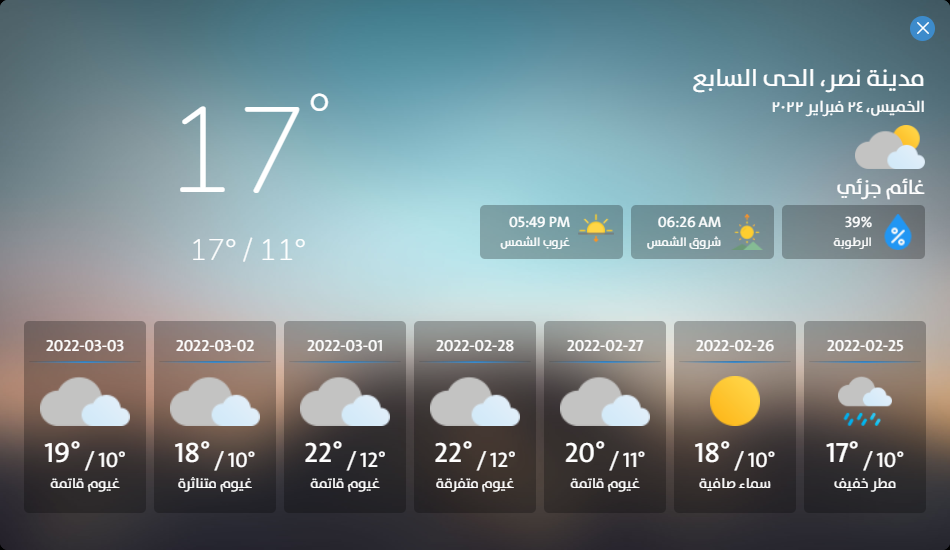

  
  <h3 align="center">Lands-Co</h3>
  <h4 align="center">For Armed Forces Lands Projects Authority</h4>
  

    <strong>Lands-Co</strong> is an offline data viewer program that gets data from <a href="https://github.com/MahmoudSharaf55/Lands-Co-Collector" target="_blank">Lands-Co Collector</a>
  as JSON files and displays in an awsome way for users to find out the latest news in terms of weather conditions, 
  corona statistics, prayer times, today's matches, and currencies price.
     
     
    <a href="https://github.com/MahmoudSharaf55/Lands-Co/issues/new">Have a bug</a>
    &nbsp~&nbsp
    <a href="https://github.com/MahmoudSharaf55/Lands-Co/issues/new">Have a new feature</a>
     

  

## 📱 Screenshots

  <h4>Main Screen</h4>
  
  <h4>Weather Details Screen</h4>
  
  <h4>Corona Details Screen</h4>
  
  <h4>Football Details Screen</h4>
  
  <h4>Prayer times Details Screen</h4>
  

 

## ✨ Features

|             **Features**           |
| :---------------------------------------------------- |
| Azan alarm for every prayer time by showing a small banner bottom right of the screen |
| Send and reply to messages with sound from PC "Device Name or IP" to another "Device Name or IP" |
| Enable & Disable any sounds "only showing the banner without sound" |
| Auto-detect the changes of data and JSON files and refresh the main screen automatically |
| Autostart with starting windows and minimize in tray |
| Manual refresh the main screen |
| Light & Dark Mode |
| Awesome user interface |

## ✅ Supported Platforms

## 🛠️ Technologies

* Node.js 16.13.1
* Electron 16.0.5

## 🚩 License

## 💻 Authors

[**Ma7MOoOD SHaRaF**](https://github.com/MahmoudSharaf55)

 

> **Thanks ❤️**
